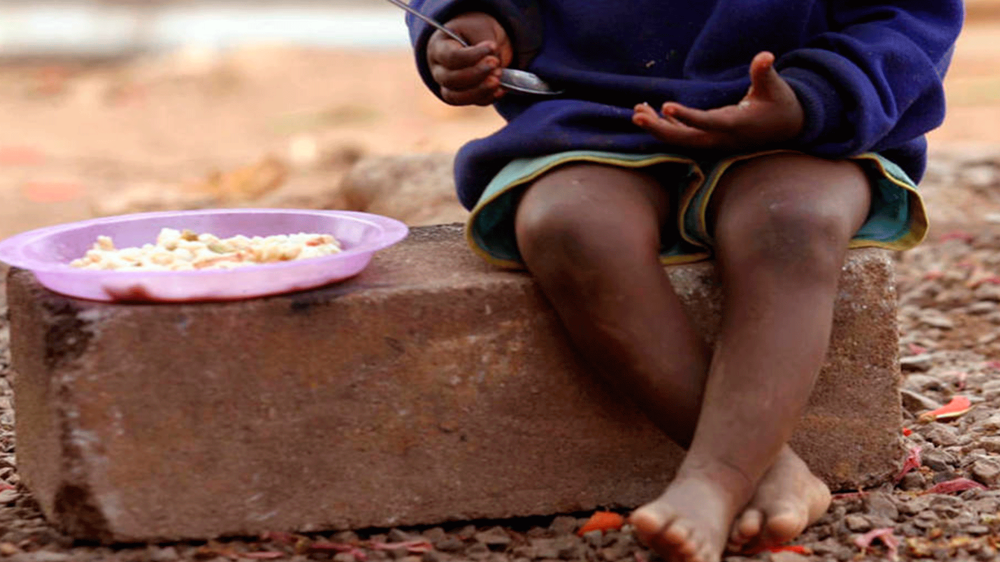

# Preface {.unnumbered}

::: {#toc-imagen-container
{width="80%"}
:::

```{r}
#| label: setup
#| include: false

knitr::opts_chunk$set(
  echo = TRUE,
  warning = FALSE,
  message = FALSE,
  fig.width = 7,
  fig.height = 5
)
```

